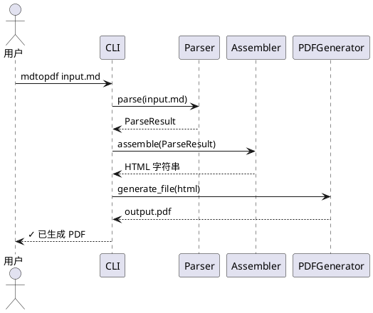
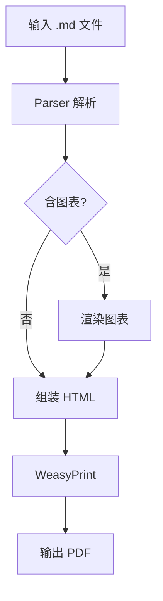
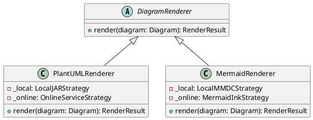
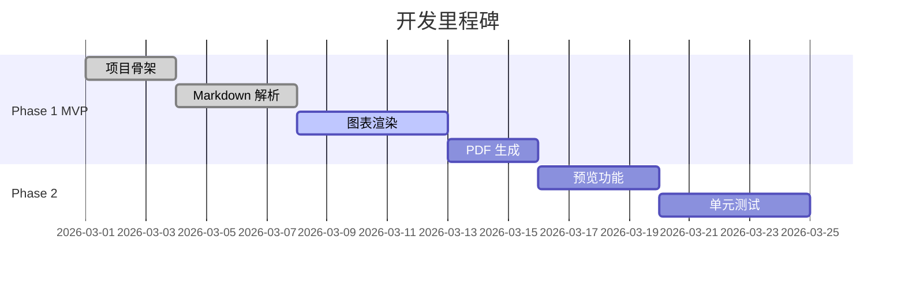

# 系统架构文档

本文档展示 PlantUML 和 Mermaid 图表的渲染效果。

## PlantUML 时序图



## Mermaid 流程图



## PlantUML 类图



## Mermaid 甘特图



## 与代码块混合

正常代码块不受影响：

```python
class HTMLAssembler:
    def assemble(self, parse_result):
        render_results = self._render_diagrams(parse_result.diagrams)
        return self._build_html(render_results)
```

| 渲染引擎 | 本地模式 | 在线模式 |
|----------|----------|----------|
| PlantUML | java -jar plantuml.jar | plantuml.com |
| Mermaid  | mmdc CLI | mermaid.ink |

